# 01 — Active Directory, DNS & DHCP

Mise en place du socle de l'infrastructure : promotion du serveur en contrôleur de domaine, configuration de l'arborescence Active Directory, des zones DNS et de l'étendue DHCP, puis jonction d'un poste client au domaine.

## 🎯 Objectifs

- Préparer le serveur (nom, IP statique, fuseau horaire)
- Installer le rôle **AD DS** et promouvoir le serveur en contrôleur de domaine
- Créer une arborescence d'unités d'organisation (OU) et des comptes utilisateurs
- Configurer le **DNS** (enregistrements de zone, CNAME)
- Configurer une étendue **DHCP** active
- Joindre un poste client (`PC-CLIENT1`) au domaine `formation.com`

## 🪜 Étapes

### 1. Préparation du serveur
Renommage du serveur (`WSERVER`), configuration d'une adresse IP statique sur l'interface Ethernet0, et réglage du fuseau horaire avant toute installation de rôle.

| Renommage | Adresse IP statique | Fuseau horaire |
|---|---|---|
| 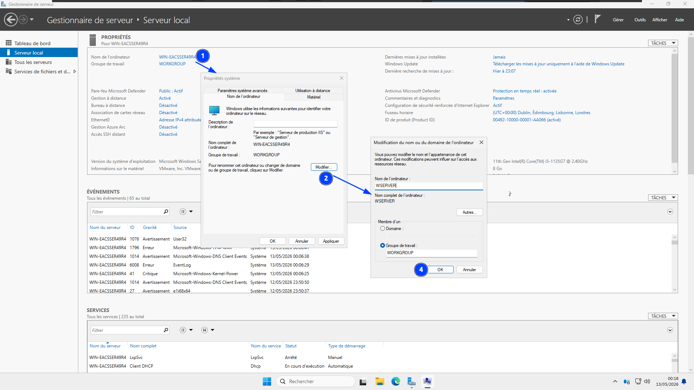 | 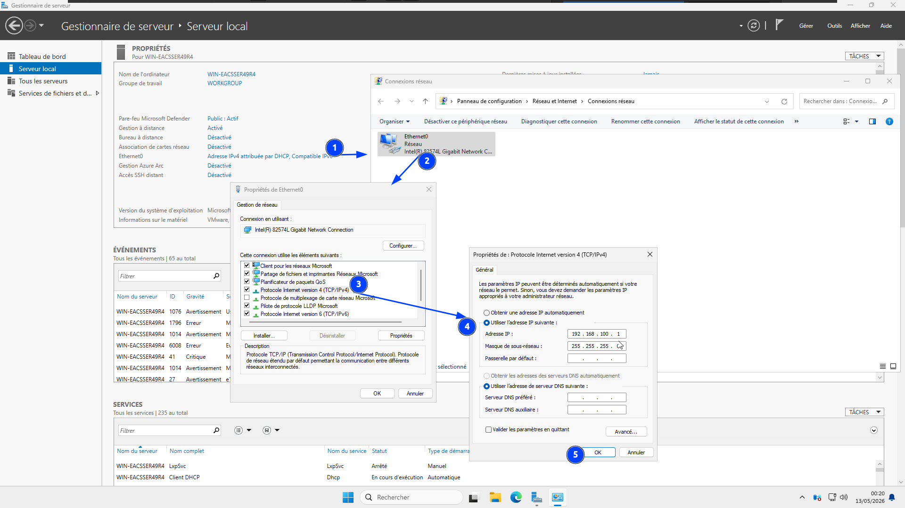 | 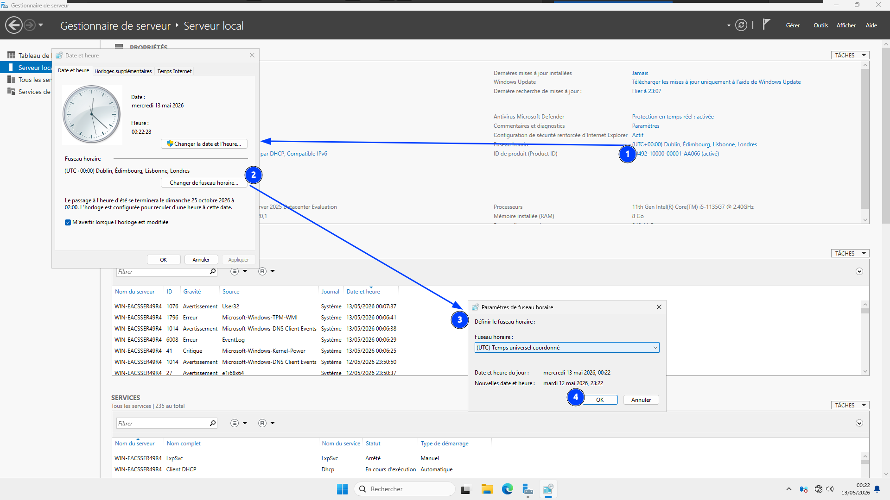 |

### 2. Installation du rôle AD DS
Ajout du rôle **Services de domaine Active Directory** via l'Assistant Ajout de rôles et de fonctionnalités, avec les outils de gestion associés (GPMC, outils AD DS).

| Sélection du rôle | Installation en cours |
|---|---|
| 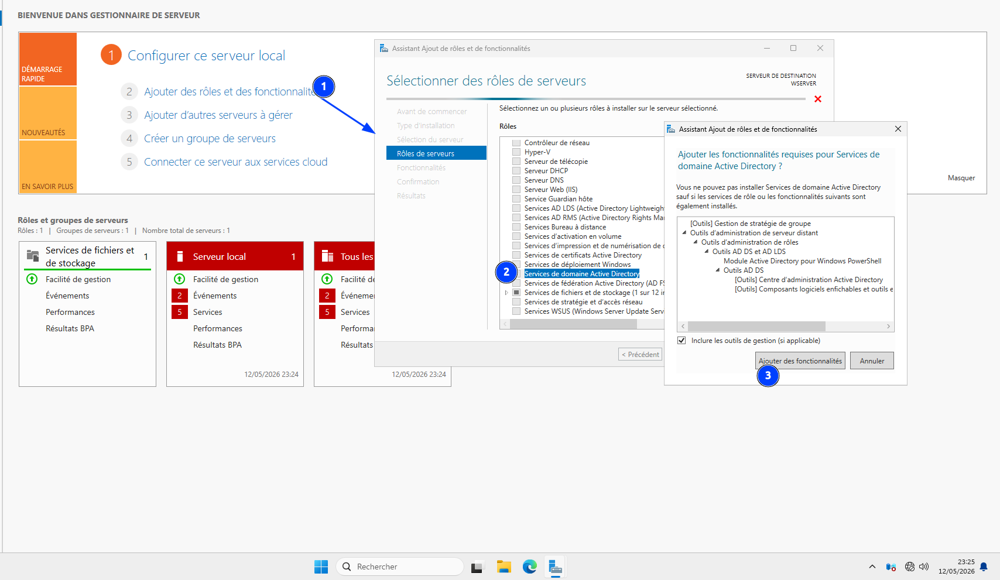 | 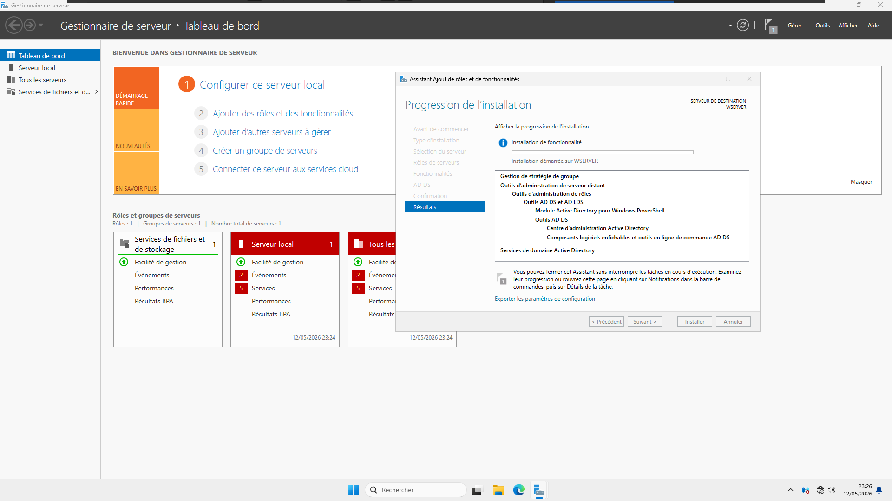 |

### 3. Promotion en contrôleur de domaine
Une fois le rôle installé, le Gestionnaire de serveur invite à promouvoir le serveur en contrôleur de domaine. Création d'une **nouvelle forêt** avec son propre nom de domaine racine.

| Notification post-installation | Création de la forêt |
|---|---|
| 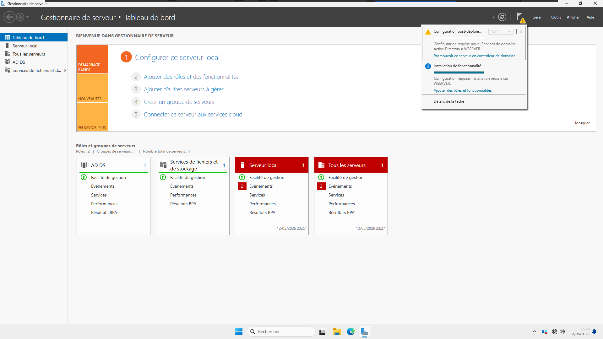 | 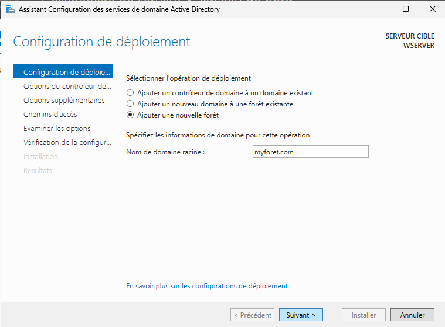 |

### 4. Structure Active Directory
Création d'une unité d'organisation (**IVISION**) contenant deux sous-OU (**USERS**, **MANAGERS**) et des comptes utilisateurs. Le rôle **DNS** est automatiquement installé avec AD DS.

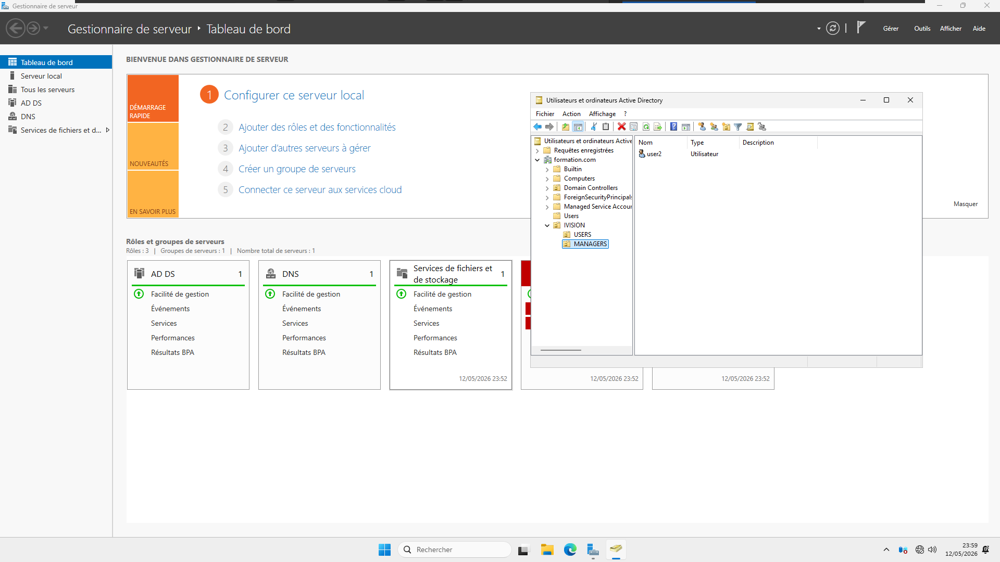

### 5. Jonction d'un poste client au domaine
Test de connectivité (`ping`) vers le contrôleur de domaine, puis jonction du poste `PC-CLIENT1` au domaine `formation.com` via les propriétés système.

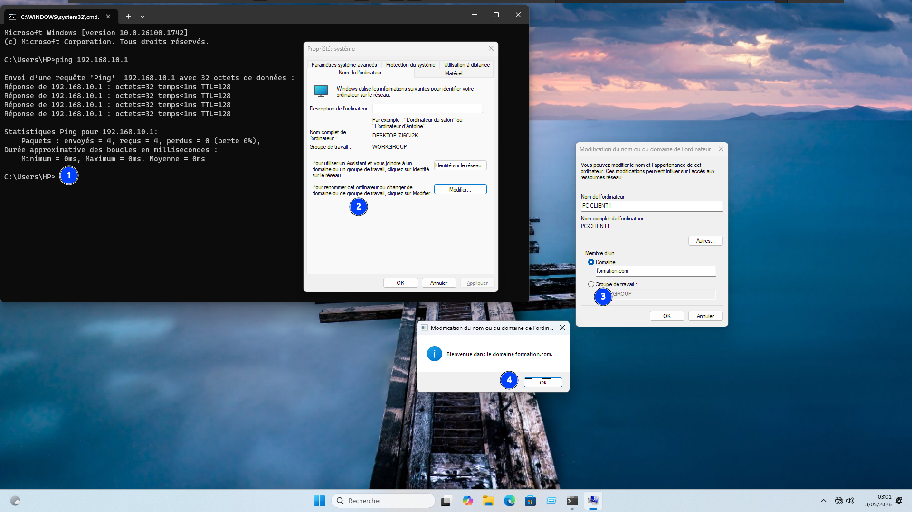

### 6. Configuration DNS
Création d'un enregistrement **CNAME** (`www`) pointant vers le contrôleur de domaine, dans la zone de recherche directe `formation.com`.

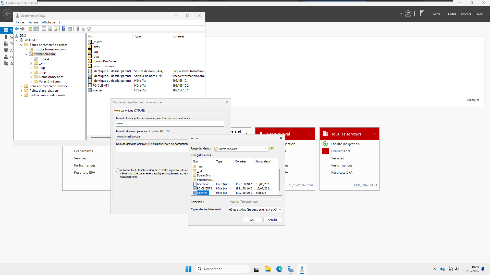

### 7. Configuration DHCP
Installation du rôle DHCP et activation d'une étendue (`WSERVER_POOL`) sur le réseau `192.168.10.0`, permettant l'attribution dynamique d'adresses IP aux postes du domaine.

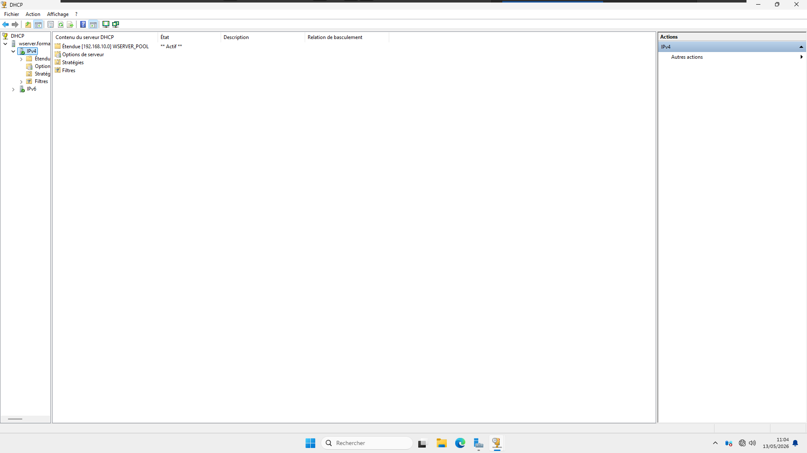

## 🧰 Technologies

`Active Directory Domain Services` `DNS` `DHCP` `Windows Server` `VMware Workstation`

## 💡 Points clés retenus

- L'ordre des étapes compte : nom du serveur et IP statique **avant** la promotion en DC, sinon le contrôleur de domaine peut référencer un nom/IP obsolète.
- Le rôle DNS est installé automatiquement lors de la promotion AD DS — pas besoin de l'ajouter séparément.
- La structure en OU (IVISION > USERS / MANAGERS) prépare le terrain pour l'application ciblée de GPO (voir [module 02](../02-gpo/)).
