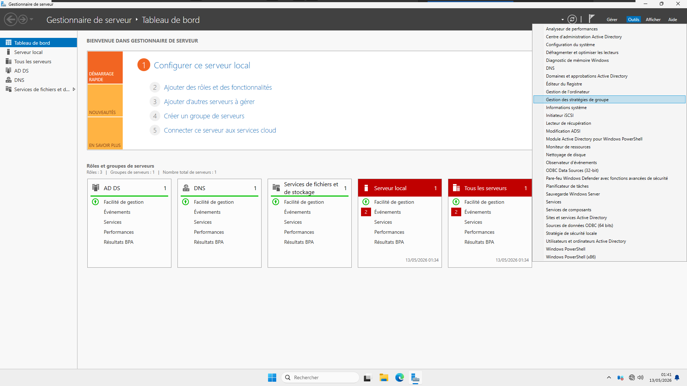
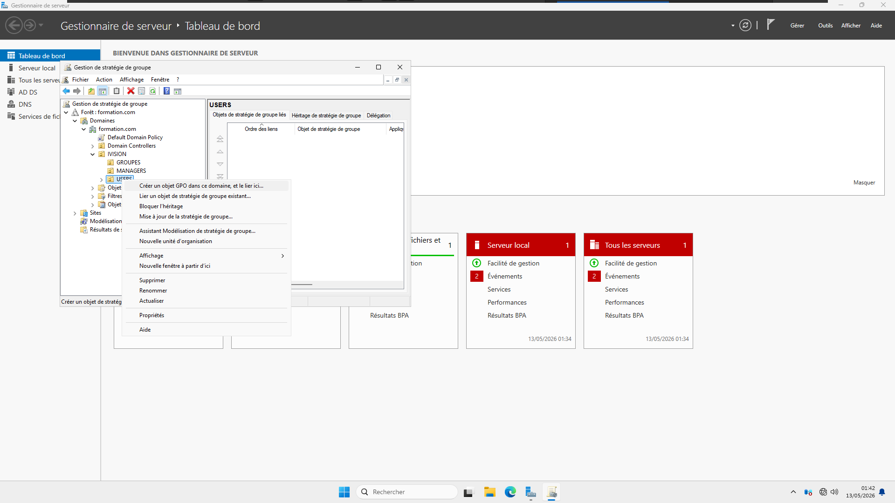
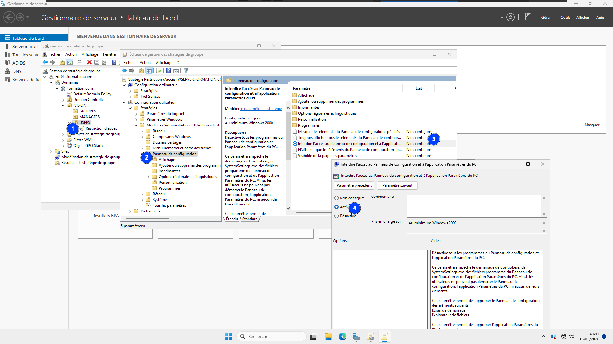

# 02 — Stratégies de groupe (GPO)

Application d'une stratégie de groupe ciblée sur une unité d'organisation, afin de restreindre l'accès au Panneau de configuration pour les utilisateurs du groupe **USERS**.

## 🎯 Objectifs

- Ouvrir la **Gestion des stratégies de groupe (GPMC)**
- Créer un objet GPO lié à l'unité d'organisation `IVISION/USERS`
- Configurer une restriction d'accès au Panneau de configuration via les modèles d'administration

## 🪜 Étapes

### 1. Ouverture de la console GPMC
Accès à l'outil **Gestion des stratégies de groupe** depuis le menu Outils du Gestionnaire de serveur.

### 2. Création de la GPO sur l'OU cible
Clic droit sur l'unité d'organisation `USERS` (sous `IVISION`) pour créer un nouvel objet GPO et le lier directement à cette OU — la stratégie ne s'appliquera donc qu'aux comptes de ce groupe.

### 3. Configuration de la restriction
Dans **Configuration utilisateur → Modèles d'administration → Panneau de configuration**, activation du paramètre **"Interdire l'accès au Panneau de configuration et à l'application Paramètres du PC"**.

## 🧰 Technologies

`Group Policy Management Console (GPMC)` `Active Directory` `Modèles d'administration`

## 💡 Points clés retenus

- Lier une GPO directement à une **OU** (plutôt qu'au domaine entier) permet une application ciblée — ici uniquement le groupe USERS, et non les administrateurs.
- Le paramètre "Interdire l'accès au Panneau de configuration" bloque aussi bien `Control.exe`, `SystemSettings.exe` que l'application Paramètres du PC.
- Une mise à jour de la stratégie (`gpupdate /force`) côté client est nécessaire pour appliquer immédiatement les changements.
