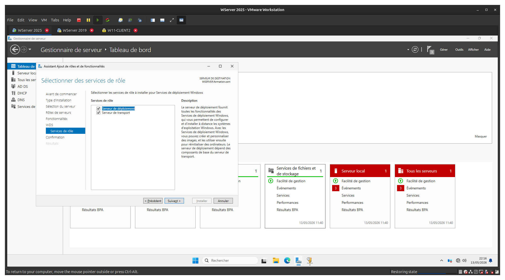
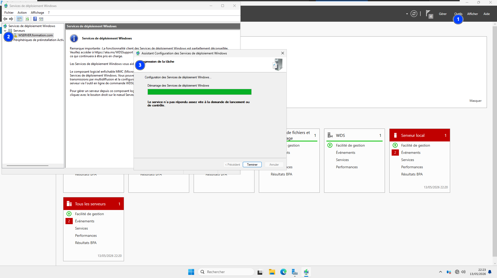
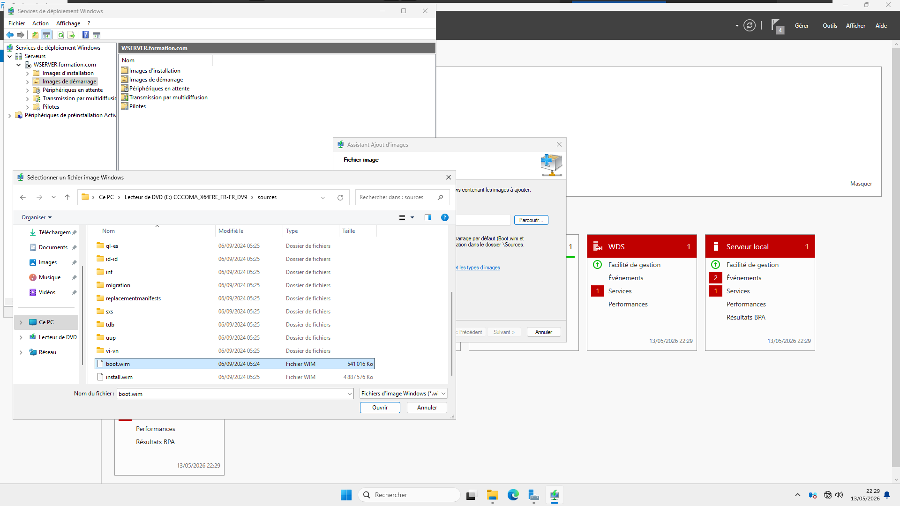
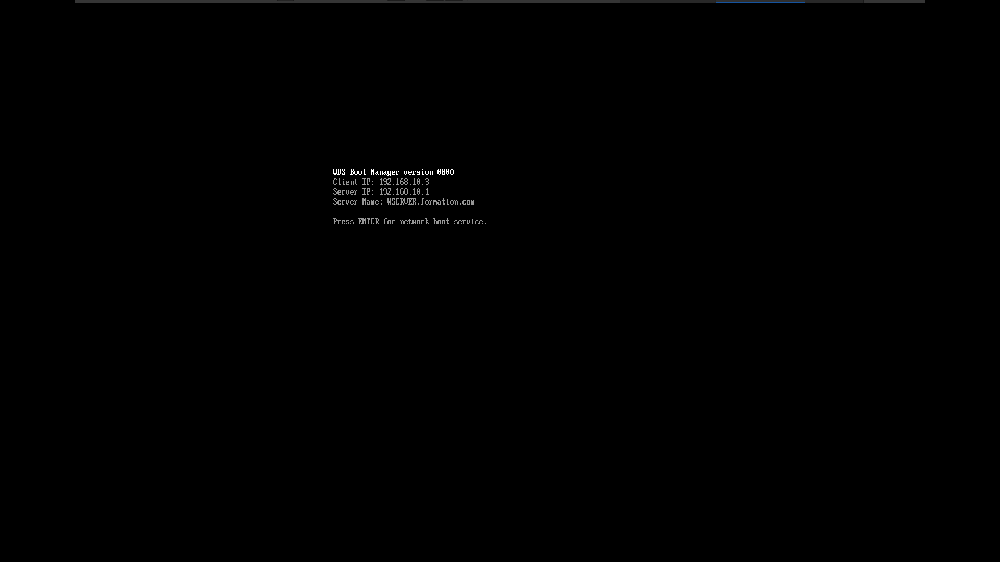

# 03 — Windows Deployment Services (WDS)

Installation et configuration des **Services de déploiement Windows** afin de permettre le démarrage et l'installation d'un système via le réseau (PXE), sans support physique sur le poste client.

## 🎯 Objectifs

- Installer le rôle **WDS** (serveur de déploiement + serveur de transport)
- Configurer le service WDS sur le contrôleur de domaine
- Ajouter une image de démarrage (`boot.wim`) depuis le support d'installation Windows
- Valider le démarrage réseau (PXE) depuis un poste client

## 🪜 Étapes

### 1. Installation du rôle WDS
Sélection des deux services de rôle nécessaires : **Serveur de déploiement** (gestion des images et des clients) et **Serveur de transport** (diffusion réseau de base).

### 2. Configuration du service WDS
Lancement de l'Assistant de configuration des Services de déploiement Windows pour initialiser le serveur (`WSERVER.formation.com`) et démarrer le service.

### 3. Ajout d'une image de démarrage
Import de `boot.wim` depuis le dossier `sources` de l'ISO Windows dans le nœud **Images de démarrage** — cette image est servie aux clients qui démarrent via PXE.

### 4. Test : démarrage PXE côté client
Le client démarre sur le réseau, contacte le serveur WDS (`192.168.10.1` → `WSERVER.formation.com`) et obtient une adresse IP (`192.168.10.3`). L'écran **WDS Boot Manager** confirme que le service répond correctement.

## 🧰 Technologies

`Windows Deployment Services` `PXE` `DHCP` `Images WIM`

## 💡 Points clés retenus

- WDS dépend du **DHCP** pour attribuer une adresse au client qui démarre en PXE — les deux rôles doivent être actifs sur le même réseau.
- `boot.wim` (image de démarrage légère, WinPE) et `install.wim` (image du système complet) ont des rôles distincts : seul `boot.wim` est nécessaire pour amorcer le menu de déploiement.
- L'écran "Press ENTER for network boot service" est le signe que le client a correctement localisé le serveur WDS via PXE.
