# 04 — Redondance & Haute Disponibilité (NLB + Failover Clustering)

Mise en place de deux mécanismes de haute disponibilité sous Windows Server : la **répartition de charge réseau (NLB)** pour un service web, et le **clustering de basculement (Failover Clustering)** avec stockage partagé iSCSI pour un serveur de fichiers hautement disponible.

## 🏗️ Topologie du lab

| VM | Rôle |
|---|---|
| `SRV-NLB1` / `SRV-NLB2` | Nœuds du cluster NLB (IIS) |
| `SRV-FC1` / `SRV-FC2` | Nœuds du cluster de basculement |
| `SRV-ISCSI` | Cible iSCSI — stockage partagé |

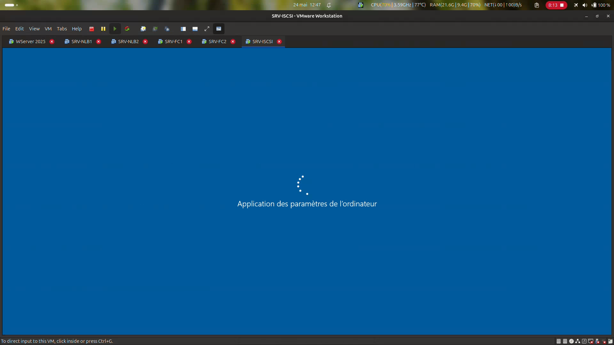

---

## 🟦 Partie A — Network Load Balancing (NLB)

### 🎯 Objectif
Répartir le trafic HTTP entre deux serveurs web (IIS) via une adresse IP de cluster unique, en mode **monodiffusion (unicast)**.

### 🪜 Étapes

**1. Préparation des nœuds**
Ajout de la fonctionnalité **Équilibrage de la charge réseau** sur chaque serveur (`SRV-NLB1`, `SRV-NLB2`), et installation du rôle **IIS** pour disposer d'un service web à tester.

| Ajout fonctionnalité NLB | Installation IIS |
|---|---|
| 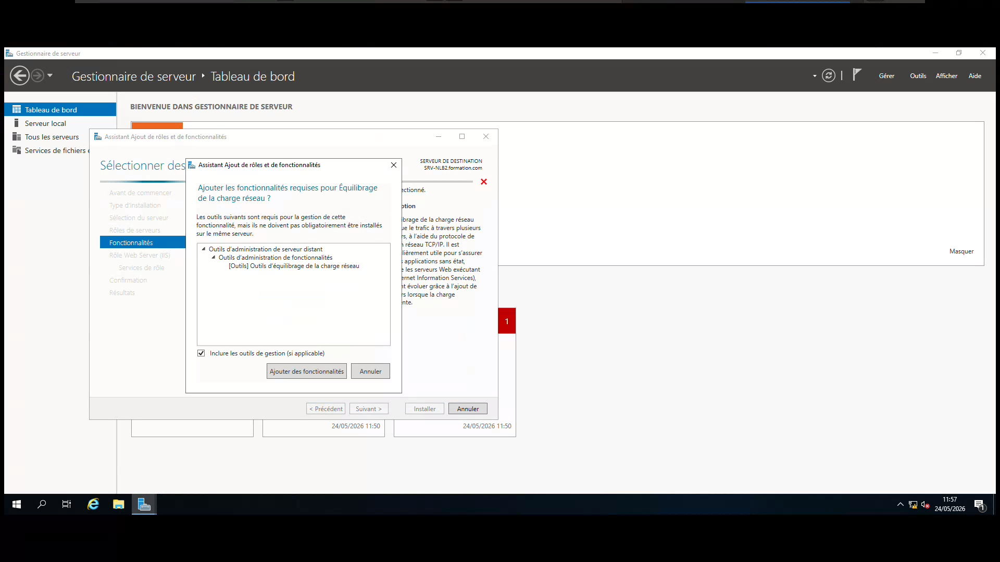 | 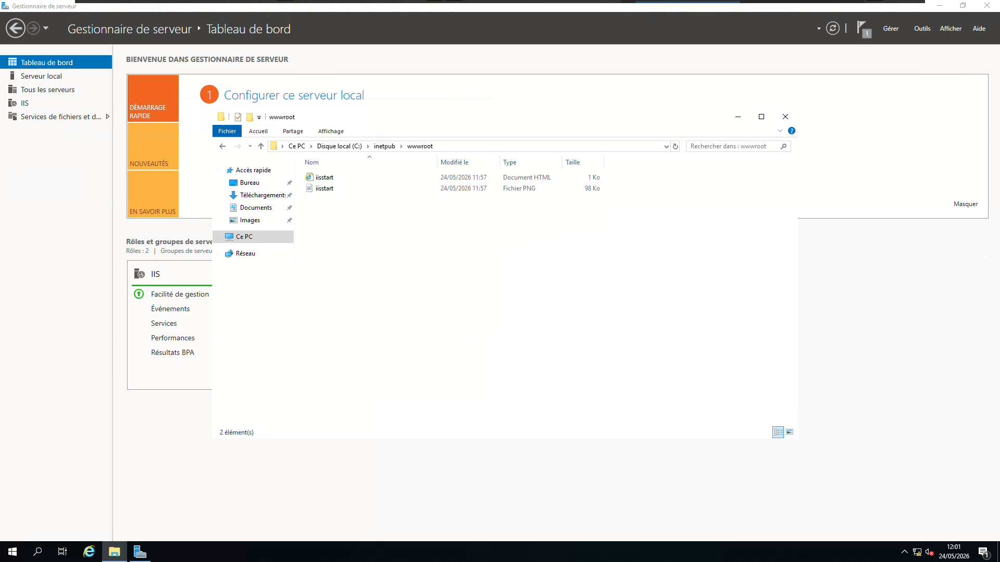 |

**2. Création du cluster**
Connexion au premier hôte (`192.168.10.10`) via le **Gestionnaire NLB**, puis configuration de l'adresse IP du cluster (`192.168.10.20`), du nom complet (`cluster.formation.com`) et du mode **monodiffusion**.

| Connexion premier nœud | Paramètres du cluster |
|---|---|
| 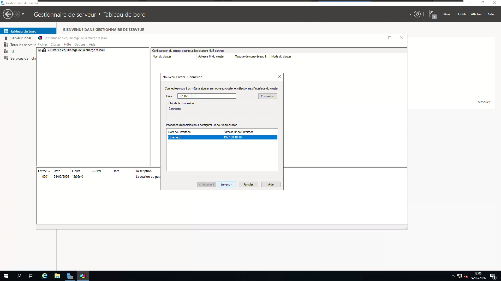 | 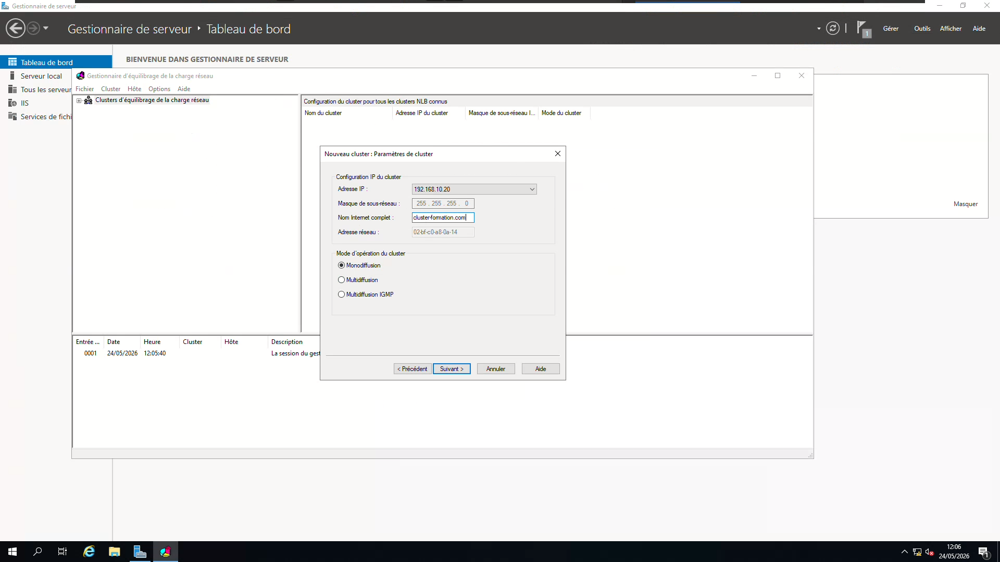 |

**3. Ajout du second nœud**
Connexion du second hôte (`192.168.10.11`) au cluster existant — le cluster passe à l'état **"Convergé"** une fois les deux nœuds synchronisés.

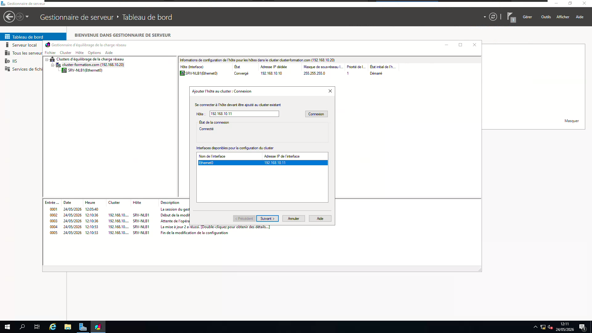

**4. Test de répartition de charge**
Un `ping -t` continu vers l'IP du cluster (`192.168.10.20`) confirme la disponibilité, tandis que le navigateur affiche **"Page du cluster 2"** — preuve que la requête a été distribuée vers le second nœud.

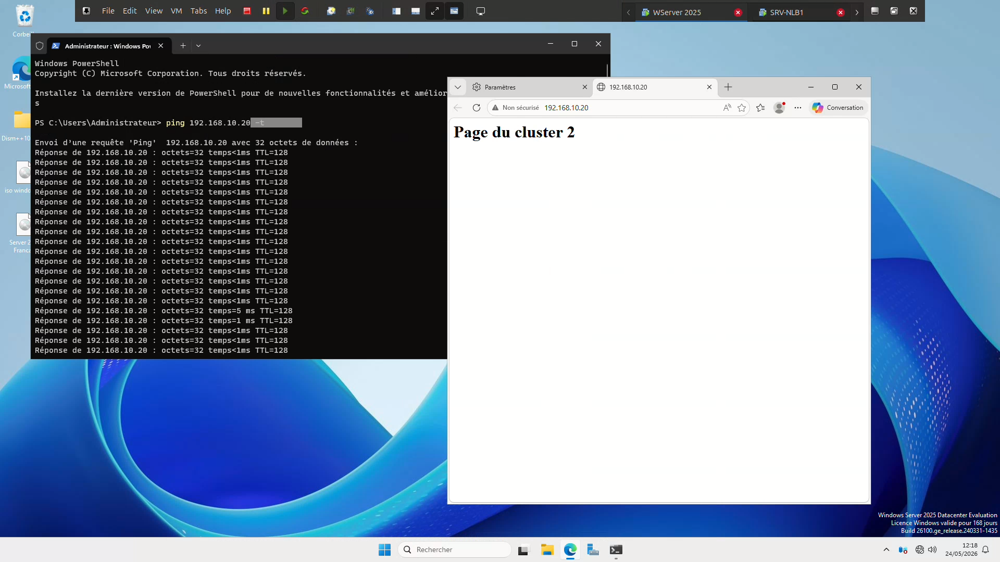

### 💡 Points clés — NLB
- En environnement **VMware**, le mode multidiffusion (multicast) peut poser des conflits d'adresse MAC selon la configuration réseau de l'hyperviseur — le mode **unicast** est plus simple à mettre en œuvre en lab.
- L'IP du cluster est **distincte** des IP individuelles de chaque nœud : c'est elle qui est publiée en DNS (`cluster.formation.com`) et utilisée par les clients.
- Le test par actualisation de page (avec contenu différencié par nœud) est le moyen le plus simple de prouver visuellement que la répartition fonctionne.

---

## 🟩 Partie B — Failover Clustering avec stockage iSCSI

### 🎯 Objectif
Construire un cluster de basculement à deux nœuds (`SRV-FC1`, `SRV-FC2`) avec un disque partagé **iSCSI**, hébergeant un rôle **Serveur de fichiers** hautement disponible.

### 🪜 Étapes

**1. Préparation du stockage partagé (iSCSI)**
Installation du rôle **Serveur cible iSCSI** sur `SRV-ISCSI`, puis création d'un disque virtuel iSCSI (30 Go) sur le volume `E:`.

| Cible iSCSI vide | Disque non alloué (30 Go) | Rôle iSCSI installé |
|---|---|---|
| 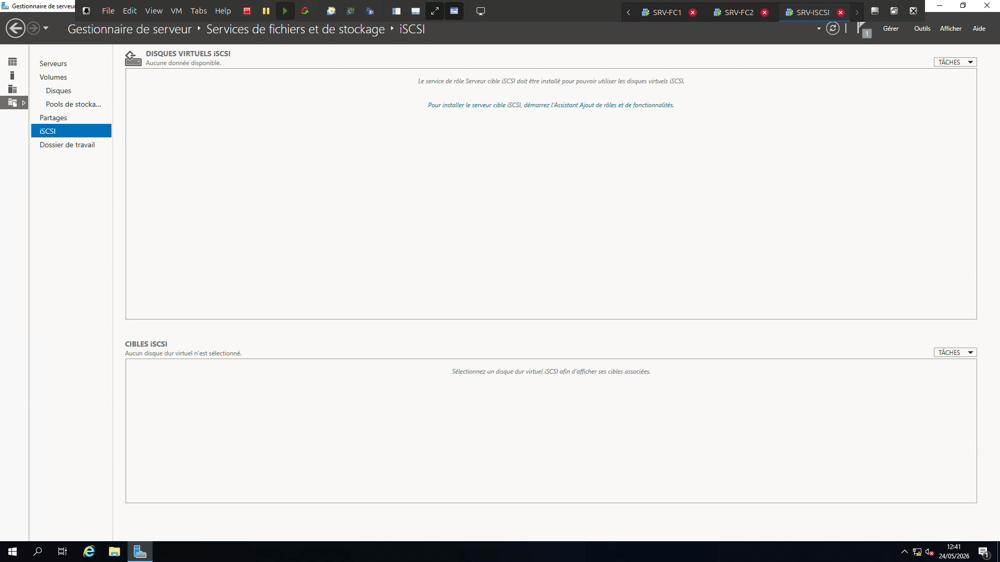 | 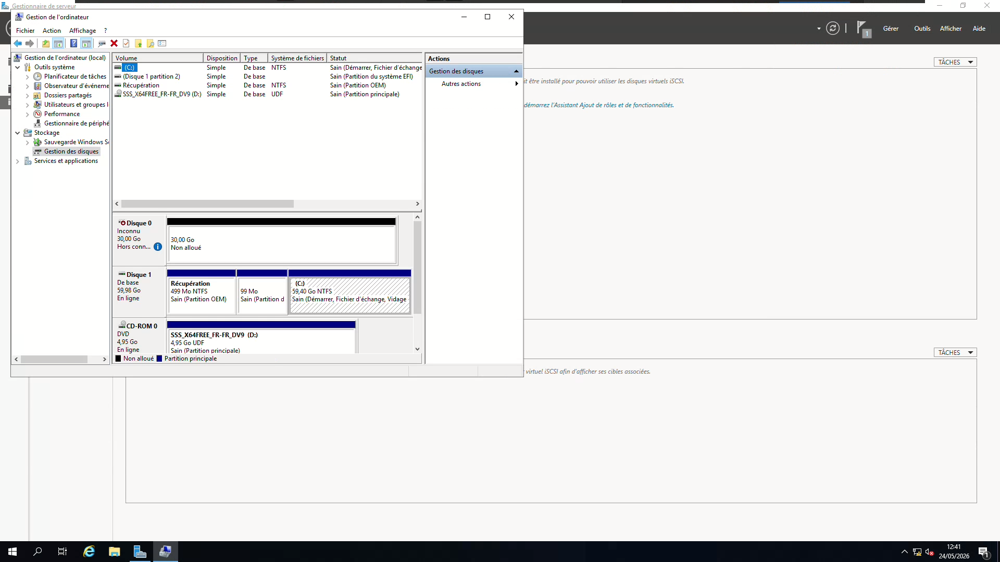 | 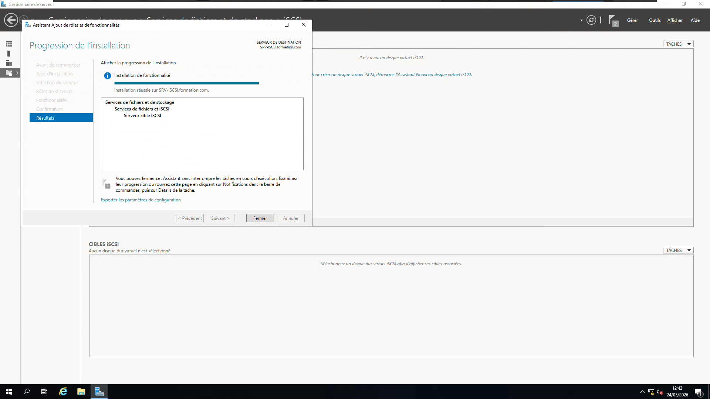 |

**2. Création du disque virtuel et autorisation des initiateurs**
Création du disque virtuel iSCSI, puis ajout des **initiateurs autorisés** par adresse IP (`192.168.10.30` et les nœuds du cluster) pour qu'ils puissent s'y connecter.

| Création disque virtuel | Autorisation initiateurs |
|---|---|
| 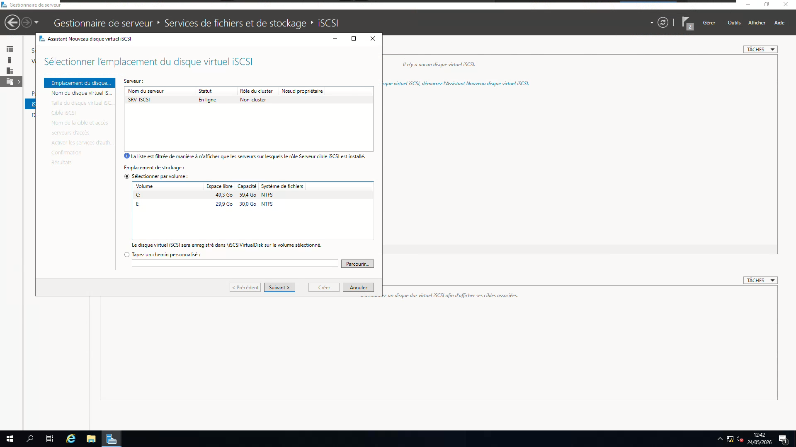 | 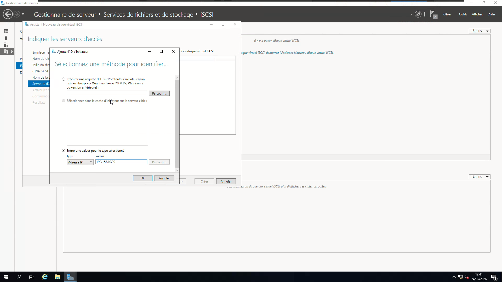 |

**3. Connexion des nœuds à la cible iSCSI**
Depuis `SRV-FC2`, l'**Initiateur iSCSI** se connecte à la cible publiée par `SRV-ISCSI` (`iqn.1991-05.com.microsoft:srv-iscsi-cluster-target-target`) — statut **Connecté**.

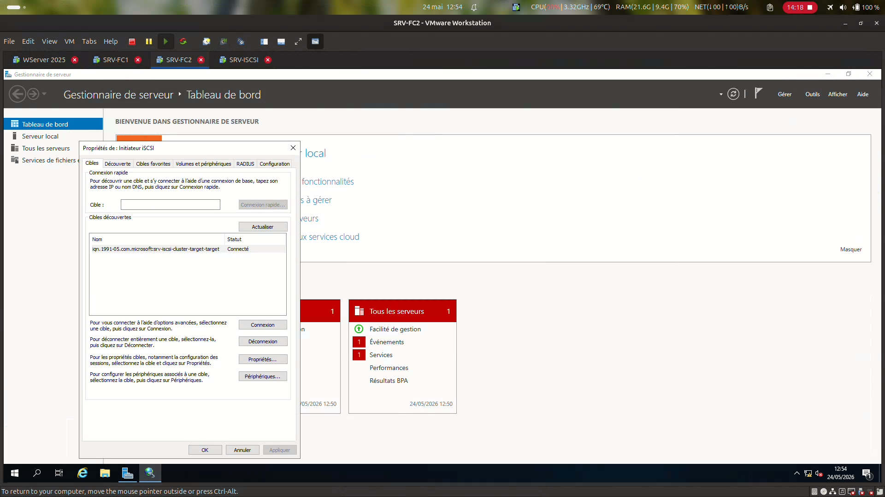

**4. Installation de la fonctionnalité Clustering de basculement**
Ajout de la fonctionnalité **Clustering de basculement** (+ outils d'administration) sur `SRV-FC1` et `SRV-FC2`.

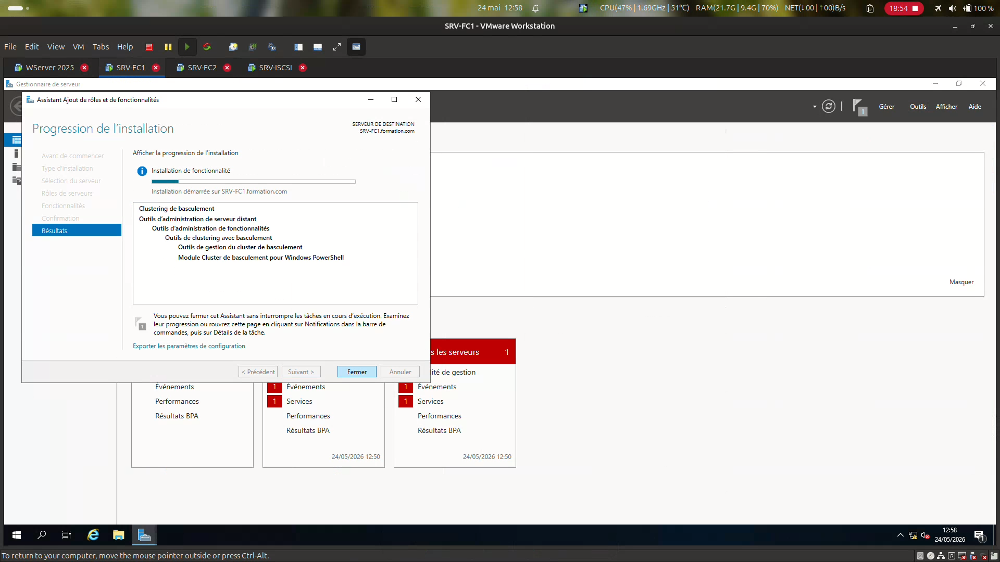

**5. Validation et création du cluster**
Validation de la configuration matérielle/réseau des deux nœuds, puis création du cluster **`CLUSTER-FS`** avec une adresse d'administration sur le réseau `192.168.10.0/24`.

| Validation de la configuration | Création du cluster CLUSTER-FS |
|---|---|
| 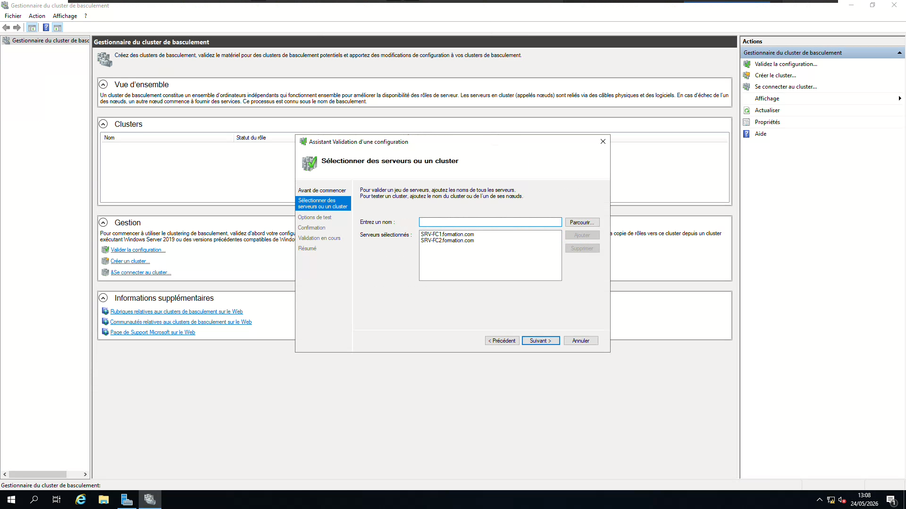 | 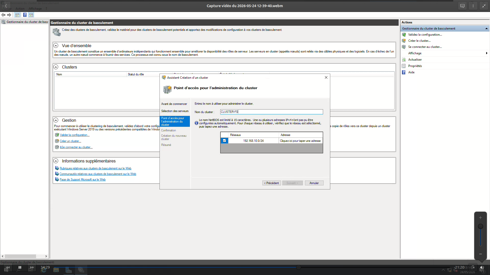 |

**6. Configuration du rôle Serveur de fichiers en haute disponibilité**
Via l'**Assistant Haute disponibilité**, configuration du rôle **Serveur de fichiers** sur le cluster — il utilisera le disque iSCSI partagé comme stockage.

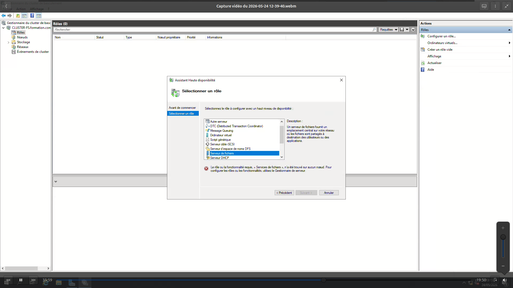

**7. Configuration du quorum**
Accès aux **paramètres de quorum du cluster**, puis sélection d'une configuration **avancée** avec vote de **tous les nœuds** (`SRV-FC1`, `SRV-FC2`) — le quorum garantit qu'un seul sous-ensemble de nœuds peut piloter le cluster en cas de partition réseau (split-brain).

| Menu quorum | Configuration avancée | Vote de tous les nœuds |
|---|---|---|
| 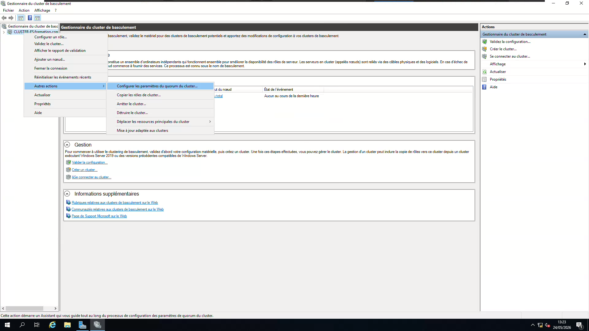 | 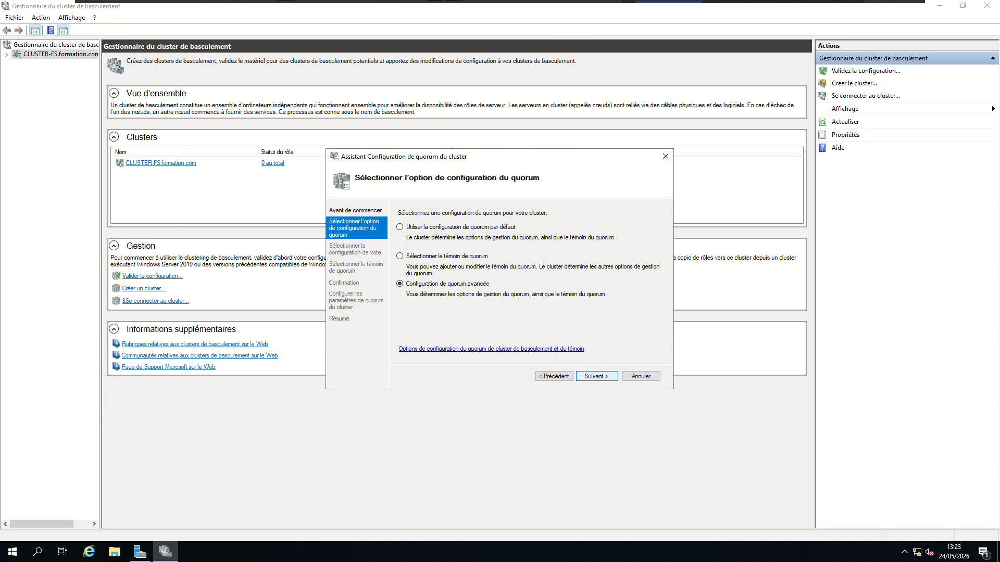 | 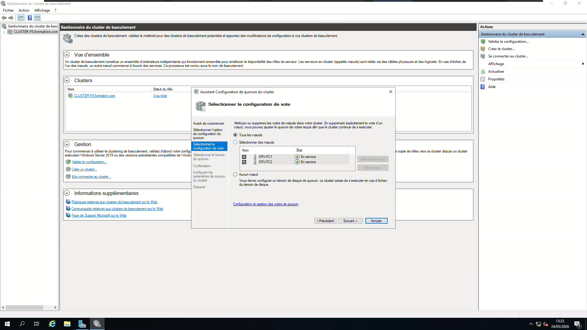 |

**8. Test : accès au partage hautement disponible**
Accès depuis un poste client à l'adresse réseau du **rôle clusterisé** (`\\192.168.10.50`) — le partage est accessible indépendamment du nœud physique qui héberge actuellement le rôle.

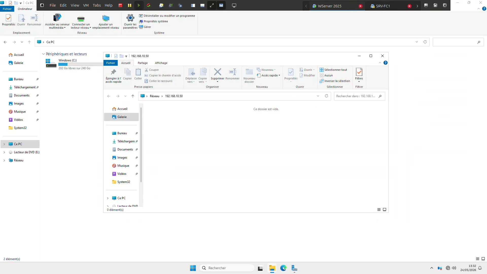

### 💡 Points clés — Failover Clustering
- Le stockage partagé **iSCSI** est le pont entre les deux nœuds : sans lui, impossible de migrer un rôle d'un nœud à l'autre sans perte de données.
- Le **quorum** est essentiel : il détermine combien de nœuds doivent être "vivants et d'accord" pour que le cluster reste opérationnel — avec 2 nœuds seulement, chaque voix compte.
- L'adresse réseau du **rôle** (`192.168.10.50`) est différente de l'adresse d'administration du **cluster** (`192.168.10.0/24`) — c'est cette première adresse que les clients utilisent pour accéder au service, quel que soit le nœud actif.

---

## 🧰 Technologies

`Network Load Balancing (NLB)` `Failover Clustering` `iSCSI` `IIS` `Quorum` `Windows Server` `VMware Workstation`
